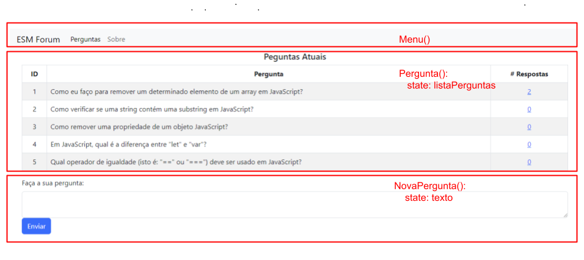

# ESM Forum - Frontend 

Este repositório contem o frontend do sistema ESM Forum, implementado agora em React.

## Instalação e Execução

O backend do sistema continua disponível neste [repositório](https://github.com/mtov/esmforum).

Para instalar o frontend, primeiro clone o repositório:

``` git clone https://github.com/mtov/esmforum-react.git```

Em seguida, instale as dependências do frontend:

```
npm install
```

E, por fim, para executar o frontend use:

```
npm start
```

**Importante:** Antes de executar o frontend, certifique-se de que o backend já está em execução.

## Arquitetura

A implementação do frontend é constituída por cinco arquivos principais:

* index.js: ponto de entrada da aplicação
* Pages/Menu.js: implementa um componente `Menu()` que renderiza o menu do topo da página
* Pages/Pergunta.js: implementa dois componentes, `Pergunta()` e `NovaPergunta()`, conforme ilustrado na figura abaixo.
* Pages/Resposta.js: implementa dois componentes, `Resposta()` e `NovaReposta()`, similares àqueles da página de Pergunta.
* Pages/Sobre.js: implementa um componente que mostra a página com informações sobre o sistema



